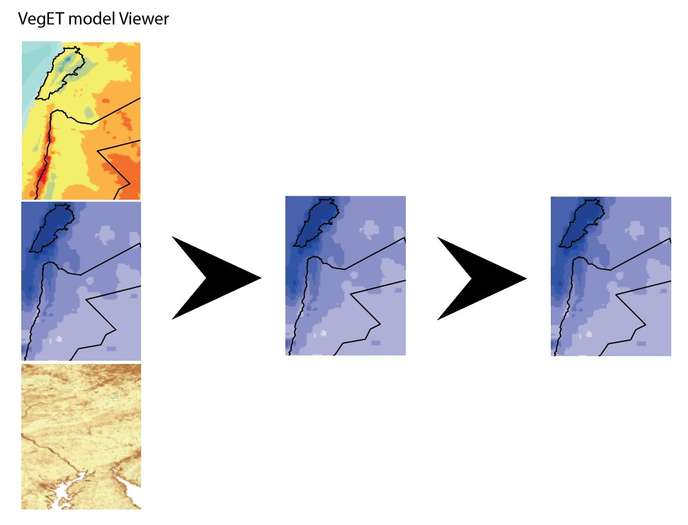

Build Image viewers for visual evaluation
=========================================

- First efforts in Jupyter Notebook for single image Viewing in Holoview
- Explore different viewer modules in Python
- Build a single image viewer with sliders
-
-
-
- Expand framework to include a visual set up of the VegET model

