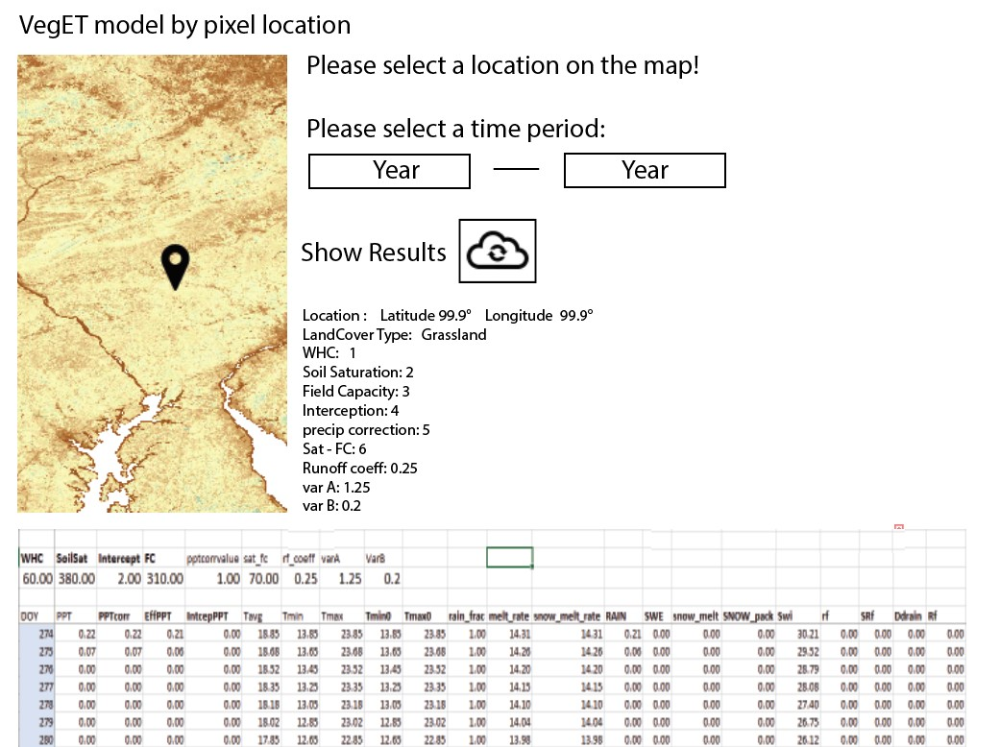

Create an application to calculate the VegET model for only 1 pixel (manual calculation sheet)
==============================================================================================

- Create Evaluation/Visualization repo 
- Build a sample point viewer
- Include to output input data values for a single point
- Use Panda data frame to create spreadsheet
- Able to export table to csv/excel/etc. for local manipulation and editing for user
