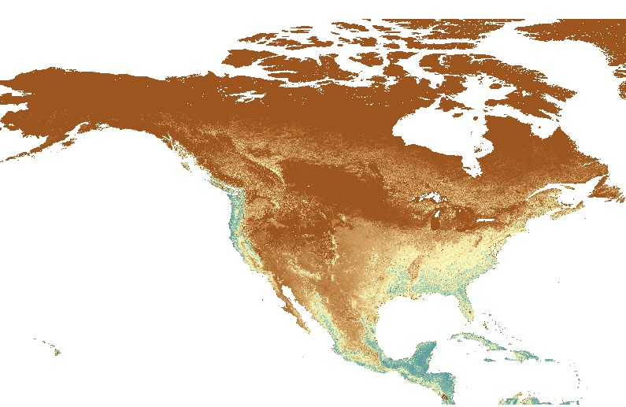

Run VegET model in the cloud for North America extent
======================================================

Tasks:

- Wrangle all of the data for North America extent to the cloud
- Created a repo for VegET continent
- Set up model to run for a 10° X 10° area for testing
- Build 10° X 10° tile viewer to monitor progress
- Evaluating model outputs
- Define a strategy to expand model for all tiles included in the CONUS extent
- Run all 10° X 10° tiles for CONUS
- Define a strategy to expand model for all tiles included in the North America extent
- Collaborate on a Cloud meets Science paper about the North America findings
